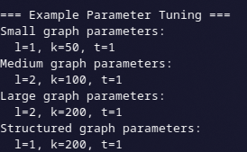

# Comparación de Algoritmos de Caminos Mínimos: Dijkstra vs BMSSP

Este proyecto compara dos algoritmos para encontrar caminos mínimos en grafos:

## Integrantes

1. Davis Coropuna Leon Felipe
2. Mogollón Cáceres Sergio Daniel
3. Maldonado Casilla Braulio Nayap
4. Lupo Condori Avelino
5. Huaman Coaquira Luciana Jullisa

## Algoritmos

1. **Dijkstra**

   - Algoritmo clásico para grafos ponderados sin aristas negativas.
   - Utiliza un heap de prioridad (min-heap) para seleccionar el nodo con la menor distancia estimada en cada paso.
   - Complejidad: (O((V+E) \log V)) usando heap.

2. **BMSSP (Bounded Multi-Source Shortest Path Algorithm)**

   - Variante de búsqueda de caminos mínimos basada en expansión de múltiples fuentes o heurísticas de priorización.
   - En la práctica puede comportarse similar a Dijkstra, pero el orden de exploración depende de su estrategia de “best-first”.

## Resultados

Se realizaron benchmarks generando grafos aleatorios y midiendo el tiempo de ejecución en función del número de nodos:

- **Gráfica 1 (nodos grandes, hasta 100000)**
  

  - Observación: Para grafos muy grandes, BMSSP tiende a ser más lento que Dijkstra en promedio.
  - Ambos algoritmos muestran un crecimiento aproximadamente lineal con el número de nodos y aristas, pero con cierta variabilidad debido a la aleatoriedad del grafo.

- **Gráfica 2 (nodos pequeños, hasta 1000)**
  

  - Observación: En grafos pequeños, ambos algoritmos tienen tiempos comparables, con BMSSP mostrando ligeros picos en algunos nodos.
  - Esto sugiere que para grafos pequeños, BMSSP y Dijkstra tienen un desempeño similar, mientras que Dijkstra es más estable.

## Ejecución del Benchmark

Para reproducir los benchmarks, siga estos pasos:

1. **Clonar el repositorio:**

   ```bash
   git clone https://github.com/LeonDavisCoropuna/Dijkstra-vs-BMSSP.git
   cd Dijkstra-vs-BMSSP
   ```

2. **Dar permisos de ejecución al script `run.sh`:**

   ```bash
   chmod +x run.sh
   ```

3. **Modificar el bucle del script `run.sh`** (si se desea personalizar el rango de nodos):

   Abra `run.sh` en un editor de texto y cambie el bucle `for` según el formato:

   ```bash
   for N in $(seq INICIO PASO FINAL); do
       ./benchmark_run $N
   done
   ```

   Por ejemplo, para ejecutar desde 1000 hasta 100000 en pasos de 1000:

   ```bash
   for N in $(seq 1000 1000 100000); do
       ./benchmark_run $N
   done
   ```

4. **Ejecutar el script:**

   ```bash
   ./run.sh
   ```

   Esto compilará el programa (`benchmark_run.cpp`) y ejecutará el benchmark para los tamaños de grafo especificados.

---

## Ejecución del Benchmark / Test

Para reproducir los ejemplos de BMSSP y Dijkstra usando `test.cpp`, siga estos pasos:

1. **Dar permisos de ejecución al script:**

```bash
chmod +x run_test.sh
```

2. **Ejecutar el script:**

```bash
./run_test.sh
```

Esto compilará `test.cpp` y ejecutará el programa, mostrando:

- Ejemplo de BMSSP en grafo simple.
  

- Ejemplo de Dijkstra.
  

- Ejemplo de BMSSP en grafo tipo cuadrícula (grid).
  

- Parámetros recomendados para distintos tamaños de grafo.
  

## Conclusión

- **Dijkstra** es más estable y predecible, especialmente en grafos grandes.
- **BMSSP** puede ser útil en grafos específicos o con estrategias de múltiples fuentes, pero tiende a ser menos consistente en tiempo de ejecución en grafos aleatorios.
- Para aplicaciones generales de caminos mínimos, Dijkstra sigue siendo la opción más confiable y eficiente.
